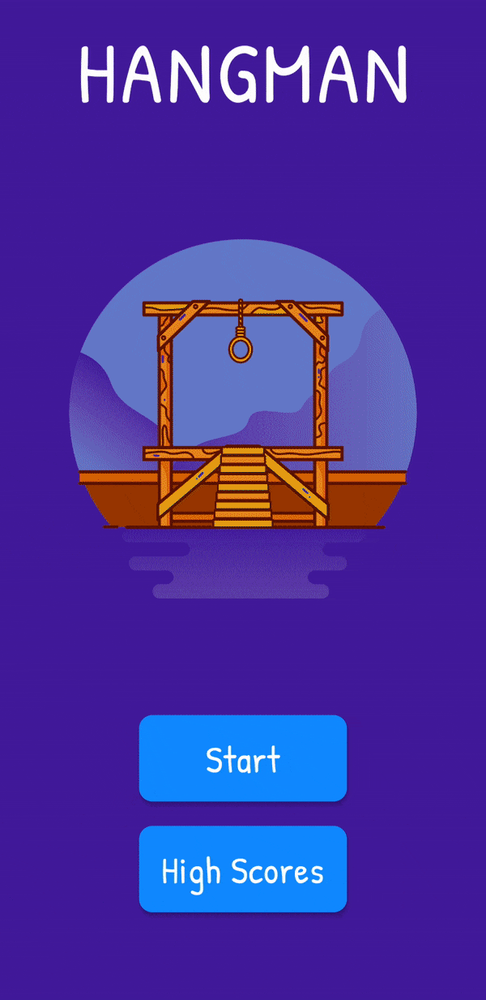

# Hangman

A hangman game is developed in Dart with the Flutter framework. It's a fun game where you have to guess the letters, and it will fill those spaces where it appears, but on a wrong guess, a body part of the hangman will be drawn. You must guess the whole word before the hangman is completed, meaning you will have five lives each turn. You can have one hint for each word to help you guess the word. After five wrong guesses, the hangman would be completed, and Game Over. It will also save your score, which you can view in the high score section.

## Live Demo

App screenshots created with <a href="https://previewed.app/">Previewed</a>

